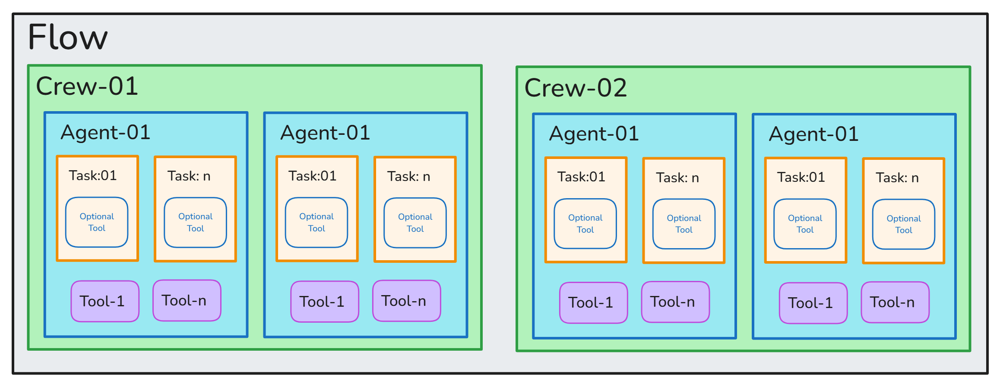

# AI Book Writer

Generate book content with AI-powered agents.

## Overview

This project uses AI to help you write books. You can specify the word count, book title, author name, target audience, and writing style. The AI agents will generate the content based on your inputs.

## How It Works

1. Enter the book details in the form.
2. Click the "Generate Book" button.
3. The AI agents will process your inputs and generate the book content.
4. You can preview the generated content and download it as a Markdown file.

## Flow Diagram




## Installation

1. Clone the repository.
2. Install the required dependencies:
   ```sh
   pip install -r requirements.txt
   ```
3. Run the Streamlit app:
   ```sh
   streamlit run src/ai_book_writer/main.py
   ```

## Dependencies

- crewai>=0.100.1
- crewai-tools>=0.33.0
- pdfkit>=1.0.0
- python-dotenv>=1.0.1
- streamlit>=1.42.0
- toml>=0.10.2
- tornado>=6.4.2
- watchdog>=6.0.0


